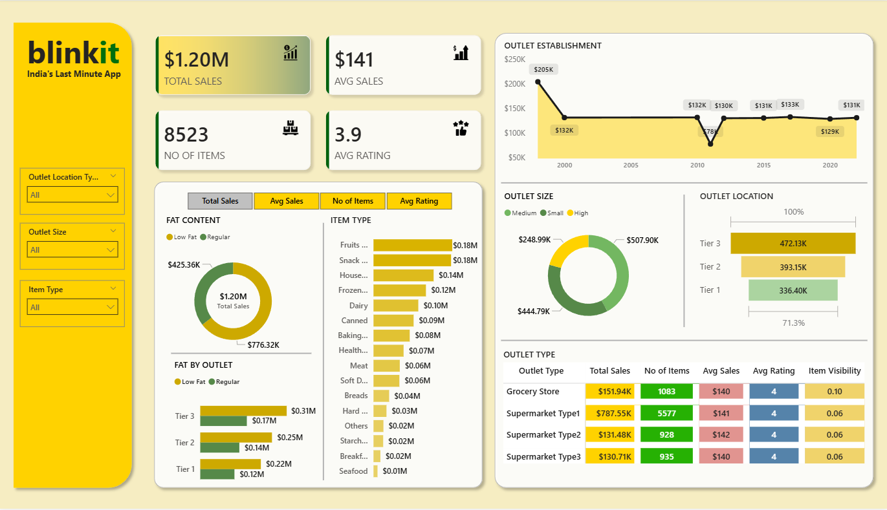

# 🛒 Blinkit Sales Analytics Dashboard

<p align="center">
  
</p>

<p align="center">
  
  
  
  
</p>

---

## 📌 Project Overview

This project presents a comprehensive **Sales Analytics Dashboard** for **Blinkit** (India's Last Minute App), built using **Power BI**. The goal was to analyze Blinkit's sales performance, customer satisfaction, and inventory distribution to identify key business insights and opportunities for optimization.

The data was first validated using **SQL Server** queries, then visualized through an interactive Power BI dashboard with dynamic filters and KPI cards.

---

## 🎯 Business Requirements

### KPI Requirements

| # | KPI | Description |
|---|-----|-------------|
| 1 | **Total Sales** | Overall revenue generated from all items sold |
| 2 | **Average Sales** | Average revenue per sale |
| 3 | **Number of Items** | Total count of different items sold |
| 4 | **Average Rating** | Average customer rating for items sold |

### Chart Requirements

| # | Chart | Objective |
|---|-------|-----------|
| 1 | Total Sales by Fat Content | Analyze the impact of fat content on total sales |
| 2 | Total Sales by Item Type | Identify performance of different item categories |
| 3 | Fat Content by Outlet | Compare sales across outlets segmented by fat content |
| 4 | Sales by Outlet Establishment | Evaluate how outlet age influences total sales |
| 5 | Sales % by Outlet Size | Analyze correlation between outlet size and sales |
| 6 | Sales by Outlet Location | Assess geographic distribution of sales |
| 7 | All Metrics by Outlet Type | Comprehensive view of all KPIs by outlet type |

---

## 📊 Dashboard Insights

### 🔢 Key Numbers
| Metric | Value |
|--------|-------|
| 💰 Total Sales | **$1.20M** |
| 🧾 Average Sales | **$141** per transaction |
| 📦 Number of Items | **8,523** items |
| ⭐ Average Rating | **3.9** / 5 |

### 🔍 Key Findings

- 📍 **Tier 3 outlets** generated the highest sales at **$472K**, outperforming Tier 1 ($336K) and Tier 2 ($393K)
- 🏪 **Supermarket Type 1** dominates with **$787K** in total sales — about **65% of total revenue**
- 🥦 **Fruits & Vegetables** and **Snack Foods** are the top item categories, each generating **$0.18M**
- 🥗 **Low Fat** products outsell Regular — **$776K vs $425K**
- 📅 Outlets established in **2018** saw the peak historical sales of **$205K**
- 🏬 **Medium-sized outlets** contribute the most to overall revenue among all outlet sizes

---

## 🔧 Tools & Technologies

| Tool | Purpose |
|------|---------|
| **Power BI Desktop** | Dashboard design, DAX measures, data modeling |
| **SQL Server** | Data cleaning, validation, and exploratory analysis |
| **DAX** | KPI calculations and dynamic measures |
| **CSV / JSON** | Raw data sources |

---

## 📁 Project Structure

```
📁 Blinkit-PowerBI-Dashboard/
│
├── 📊 blinkit_dashboard.pbix       # Main Power BI project file
├── 📄 blinkit_grocery_data.csv     # Raw dataset
├── 📝 blinkit_sql_queries.docx     # SQL queries used for data validation
├── 🖼️ dashboard_preview.png        # Dashboard screenshot
└── 📘 README.md                    # Project documentation
```

---

## 🗃️ Dataset Description

The dataset contains grocery sales records from Blinkit outlets across India.

| Column | Description |
|--------|-------------|
| `Item Fat Content` | Low Fat / Regular |
| `Item Identifier` | Unique item ID |
| `Item Type` | Product category (Fruits, Snacks, Dairy, etc.) |
| `Outlet Establishment Year` | Year the outlet was set up |
| `Outlet Identifier` | Unique outlet ID |
| `Outlet Location Type` | Tier 1 / Tier 2 / Tier 3 city |
| `Outlet Size` | Small / Medium / High |
| `Outlet Type` | Grocery Store / Supermarket Type 1/2/3 |
| `Item Visibility` | Shelf visibility score |
| `Item Weight` | Weight of the item |
| `Total Sales` | Revenue generated |
| `Rating` | Customer rating (1–5) |

---

## 🚀 How to Use

1. **Clone this repository**
   ```bash
   git clone https://github.com/rounak2601/Blinkit-PowerBI-Dashboard.git
   ```

2. **Open the Power BI file**
   - Make sure you have [Power BI Desktop](https://powerbi.microsoft.com/desktop/) installed
   - Open `blinkit_dashboard.pbix`
   - The data is already embedded — the dashboard will load directly

3. **Explore the SQL Queries**
   - Open `blinkit_sql_queries.docx` to see how data was cleaned and validated in SQL Server

---

## 📈 Project Workflow

```
Raw Data (CSV/JSON)
      ↓
Data Cleaning in SQL Server
      ↓
KPI Validation via SQL Queries
      ↓
Data Import into Power BI
      ↓
Data Modeling & DAX Measures
      ↓
Interactive Dashboard Design
      ↓
Insights & Analysis
```

---

## 👤 Author

**Rounak Kumar Tilante**

[](https://github.com/rounak2601)

---

*This project was built as part of my Data Analytics learning journey. Feel free to fork, star ⭐, or raise issues!*
